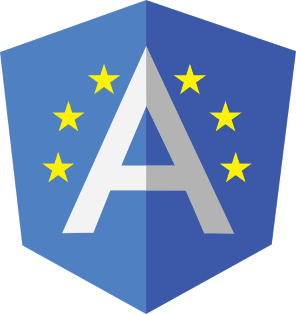

<!DOCTYPE html>
<html lang="en">
<head>
  <meta charset="UTF-8">
  <meta http-equiv="X-UA-Compatible" content="IE=edge">
  <meta name="viewport" content="width=device-width, initial-scale=1.0">
  <meta charset="UTF-8"/>
  <meta content="width=device-width, initial-scale=1" name="viewport" />
  <meta name="DC.Language" scheme="RFC1766" content="Spanish">
  <meta name="autor" content="Andres Antonio Cardoso">
  <meta name="reply-to" content="datagroupssl@gmail.com">
  <link rev="made" href="mailto:datagroupssl@gmail.com">
  <meta name="description" content="Andres Antonio Cardoso, Developer Full Stack y Diseñador Grafico.">
  <meta name="copyright" content="Propietario del copyright" />
  <meta name="keywords" contennt="desarrollo web, website, front end developer">
  <meta name="Resource-type" content="Index">
  <meta name="Revisit-after" content="1 days">
  <meta name="robots" content="all">
 <title>⠀</title>
</head>
<body>

<!-- INICIO BANNER -->

## HOLA BIENVENIDO⠀!!!.


<!-- INICIO TYPING  -->
<p align="center">
  <a href="https://github.com/DenverCoder1/readme-typing-svg">
    </a>
</p>

---

<!-- PROJECTO LOGO -->
<br />
<div align="center">
  <a href="#">
    
  </a>

  <h3 align="center">Contributing by DATA GROUP</h3>

  <p align="center">
    ¡Un increíble README para impulsar sus proyectos!!
    <br />
    <a href="https://github.com/datagroupssl"><strong>Explore los documentos »</strong></a>
    <br />
    <br />
    <a href="https://github.com/datagroupssl">Ver demostración</a>
    ·
    <a href="https://github.com/datagroupssl">Informe de error</a>
    ·
    <a href="https://github.com/datagroupssl">Solicitar nuevas funciones</a>
  </p>
</div>

<!-- INICIO EL PROYECTO -->

# TITULO DEL PROYECTO

## Guia de Inicio

<div align="center">

</div>

### 📌- DATA GROUP es un estudio creativo que da forma a las marcas del mañana.

- Formamos mundos e identidades visuales, construidos sobre la base del pensamiento y el diseño interdisciplinarios, siempre desafiando el status quo. Fusionamos el arte del Codigo con el Diseño Grafico.

✏️- Es complicado. Resulta difícil la primera vez que haces algo, especialmente cuando colaboras con otros, pues cometer errores no es nada agradable.

- Nuestro objetivo es simplificar la forma en la que los nuevos contribuidores de codigo abierto aprenden y contribuyen por primera vez.

- Leer artículos y ver tutoriales puede ayudar, pero, ¿Qué mejor que hacer las cosas en un entorno de prácticas?

- Este proyecto se enfoca en ser una guía y en simplificar la forma en la que los principiantes hacen su primera contribución.

### 🌟- Documentacion de un proyecto.

- Seguir esta guías ayuda a comunicar que tu respetas el tiempo de los Developers, colaboradores que están manejando y trabajando en este proyecto de codigo abierto.

🚨- Estos son algunos archivos `importantes` que encontraras en nuestros proyectos tomate tu tiempo para leerlos.

`CONTRIBUTORS.md` ,`LICENSE.md` y`CODE_OF_CONDUCT.md`


## PATROCINADOR⠀

<p align="center">
  <a href="https://www.nexperia.com/"></a>
  &#8287;&#8287;&#8287;&#8287;&#8287;
  <a href="https://aspidcars.com"></a>
  &#8287;&#8287;&#8287;&#8287;&#8287;
</p>


## Si quieres puedes vistar mi perfil de Github y ver mi README.

- [Github @datagroupssl](https://github.com/datagroupssl) Developer Full Stack

<!-- INICIO INDICE -->
<details>
  <summary><h3>INDICE</h3>⠀</summary>
  <ol>
    <li>
      <a href="#titulo-del-proyecto">Titulo del proyecto</a>
    </li>
    <li><a href="#estructura-de-un-proyecto">Estructura de un proyecto</a></li>
    <li><a href="#contribuciones-que-buscamos">Contribuciones que buscamos</a></li>
    <li><a href="#reglas-de-base">Reglas de base</a></li>
    <li><a href="#tu-primera-contribucion">Tu primera Contribucion</a></li>
    <li><a href="#bonus">Bonus</a></li>
    <li><a href="#tour">Tour</a></li>
    <li><a href="#como-reportar-un-bugs">Como reportar un bugs</a></li>
    <li><a href="#nuevas-caracteristicas">Nuevas caracteristicas</a></li>
    <li><a href="#revicion-de-codigo">Revicion de codigo</a></li>
    <li><a href="#comunidad">Comunidad</a></li>
    <li><a href="#commit">Commit</a></li>
    <li><a href="#autores">Autores</a></li>
    <li><a href="#agradecimientos">Agradecimientos</a></li>
    <li><a href="#licencia">Licencia</a></li>
  </ol>
</details>

---

## ESTRUCTURA DE UN PROYECTO

🌲- Esta es la estructura de archivos de proyectos, que realizamos. 🙈

```text
.
├── CHANGELOG.md
├── .github
│   ├── CODE_OF_CONDUCT.md
│   ├── CODEOWNERS
│   ├── config.yml
│   ├── CONTRIBUTING.md
│   ├── FUNDING.yml
│   ├── issue_label_bot.yaml
│   ├── ISSUE_TEMPLATE
│   │   ├── 1-bug-report.md
│   │   ├── 2-failing-test.md
│   │   ├── 3-docs-bug.md
│   │   ├── 4-feature-request.md
│   │   ├── 5-enhancement-request.md
│   │   ├── 6-security-report.md
│   │   ├── 7-question-support.md
│   │   └── config.yml
│   ├── ISSUE_TEMPLATE.md
│   ├── pull_request_template.md
│   ├── SECURITY.md
│   ├── settings.yml
│   └── SUPPORT.md
├── .gitignore
└── README.md

2 directories, 22 files
```

<p align="right">(<a href="#estructura-de-un-proyecto">back to top</a>)</p>

---

### CONTRIBUCIONES QUE BUSCAMOS

DATA GROUP es una empresa que cuenta con 3 areas de trabajo son:

`PROGRAMACION` / `DISEÑO GRAFICO` /`DOCUMENTACION`

❤️- Realizamos diferentes proyectos de código abierto con diferentes licencias MIT, GNU GLP V3.0, Apache 2.0 y nos encanta recibir contribuciones de nuestra comunidad.

❤️- Hay muchas formas de contribuir, desde escribir tutoriales o publicaciones en blogs.

❤️- Mejorar la documentación, generar reportes de nuevos bugs y solicitudes de mejoras.

❤️- Actualmente buscamos colaboradores para realizar traducciones profesionales en varios idiomas de READMES, documentacion de software, etc.

- Si sos un Diseñador Grafico con experiencia puedes enviar tu portfolio a [DATA GROUP](mailto:datagroupssl@gmail.com) Ref. D-GRAFICO

<p align="right">(<a href="#contribuciones-que-buscamos">back to top</a>)</p>

---

## REGLAS DE BASE

### 🔺- Establece expectativas de comportamiento.

Esto incluye no solamente como se comunican con los demás (siendo respetoso, considerado, etc) sino también en las responsabilidades técnicas (la importancia de hacer testing, dependencias de proyecto, etc).

- Revisa el `CODE_OF_CONDUCT.md`

`Responsabilidades:`

- Asegurate de la compatibilidad entre plataformas para cada cambio aceptado. Windows, Mac, Debian y Ubuntu Linux.

- Asegurate de que el código que va al core cumple con los requerimientos solicitados.

- Código de buenas prácticas en el desarrollo de software
  público.

- Crea issues para cualquier cambio mayor y mejora que desearias hacer. Discute las cosas de manera transparende y obten los comentarios de la comunidad.

- No agregues ninguna clase al código base a menos de que sea completemante necesario.

- Preferiblemente hacer uso de funciones.

- Manten el versionamiento de nuevas caracteristicas tan cortas como sea posible.

- Se amable con los recién llegados y apoya la diversidad de nuevas y nuevos contribuidores de todo tipo de antecedente.

- Adherimos al [Código de Conducta de la Comunidad Python](https://www.python.org/psf/codeofconduct/).

<p align="right">(<a href="#reglas-de-base">back to top</a>)</p>

---

## TU PRIMERA CONTRIBUCION

Ayuda a la gente que es nueva en el proyecto a que entiendan donde pueden ser de apoyo. Este es un buen momento también para dejarle saber a las personas si sigues alguna convención para etiquetar issues para principiantes.

Aun no sabes como empezar a contribuir con Zerho Cool? Puedes empezar revisando los issues con etiquetas principiante (beginner) y se-necesita-ayuda (help-wanted):

- Beginner (principiante) - los issues con esta etiqueta deberían de requerir unicamente unas pocas lineas de código y uno o dos tests.

- Help wanted (se necesita ayuda) - Estos son issues que pueden ser un poco más complicados que los issues de principiantes.

- Ambas listas de issues están ordenadas por la cantidad de comentarios que tienen. Aunque no es perfecto, la cantidad de comentarios es un proxy rasonable para saber el impacto que tendrá el cambio.

<p align="right">(<a href="#tu-primer-contribucion">back to top</a>)</p>

---

## BONUS

### 🔖- Agrega un enlace a recursos para personas que nunca han contribuido anteriormente.

### Te dejo un video tutorial de como hacerlo:

- [Realizar un FORK](https://www.youtube.com/watch?v=3m7Z3g_U-Cs)⠀Video tutorial en YouTube

- [Realizar un PULL REQUEST](https://www.youtube.com/watch?v=ZmrP2G9FSzw&t=11s)⠀Video tutorial en YouTube

- [Realizar un ISSUE](https://www.youtube.com/watch?v=m1_O7tIBCy4&t=79s)⠀Video tutorial en YouTube


<p align="right">(<a href="#bonus">back to top</a>)</p>

---

## TOUR

### 🕵️- Dales un rapido tour de como hacer submit a una contribución.

Cómo escribes esto, depende de tí, pero algunas cosas que debería incluir son:

- Para realizar mejoras en los READMES, Documentacion, Diseño Grafico, etc NO HACE FALTA EL `Certificado de origen del Desarrollador - DCO`

- Dejales saber si necesitan firmar un CLA, estar de acuerdo con un DCO, o cualquier otra documentación legal que se necesite.

🕵️- Certificado de origen del Desarrollador - DCO (por sus siglas en inglés) para administrar este proceso. El DCO es una declaración jurídicamente vinculante que afirma que usted es el creador de su contribución y que desea permitir que Zerho Cool utilice su trabajo.

- Dejo el Certificado de origen del Desarrollador - DCO.
- El mismo debe estar con fecha, nombre completo real NO alias y firmado por el Developer.

- Si los tests son necesarios para las contribuciones, hazles saber y explicales como ejecutar estos tests.

- Si estas usando algo distinto de GitHub para manejar tus issues (ej. JIRA or Trac), hazles saber que herramientas necesitan para contribuir.

Para cualquier cosa que sea mayor a una o dos lineas para corregir:

- 1.  Crea tu propio fork del código
- 2.  Haz los cambios en tu fork
- 3.  Si te gusta el cambio y crees que el proyecto podría utilizarlo:

- 4. Asegurate de haber seguido el estilo de código del proyecto.
- 5. Firma el Contributor License Agreement, CLA, con la Fundación jQuery.
- 6. Revisa el Código de conducta de la Fundación jQuery.
- 7. Envia un pull request indicando que tienes un archivo con el CLA.

### 🕵️- Si tienes un proceso diferente para correcciones pequeñas u "obvias", hazlo saber.

- Pequeñas contribuciones como errores de ortografía, donde el contenido es lo suficientemente pequeño como para no considerado propiedad intelectual, puede ser agregado como un patch de contribuidor, sin el CLA.

- Como regla de oro, los cambios pueden ser considerados "correcciones obvias" si estos no introducen una nueva funcionalidad o pensamiento creativo. Media vez el cambio no afecte la funcionalidad, algunos ejemplos incluyen los siguientes:
  - Correcciones de Ortografía / Gramática
  - Corrección de un error en la escritura de una palabra, espacios en blanco y cambios de formato
  - Limpieza de comentarios
  - Corrección de Bugs que cambian los valores que se retornan o códigos de error guardados en constantes
  - Agregar mensajes de logueo o salidas de debugging
  - Cambios a los archivos de ‘metadata’ como Gemfile, .gitignore, scripts de construcción, etc.
  - Mover archivos con código de un directorio o paquete a otro

<p align="right">(<a href="#tour">back to top</a>)</p>

---

## COMO REPORTAR UN BUGS

### 🛡️- Explica primero cuales son las formas de revelación de fallos en seguridad primero!

Como mínimo, incluye la siguiente oración:

- Si encuentras una vulnerabilidad de seguridad, NO abras un issue con la explicación. En vez de eso, envía un email a [DATA GROUP](mailto:datagroupssl@gmail.com) Ref. SEGURIDAD

- Si no quieres usar tu información personal, establece una dirección como "seguridad@xxxxx".

- Proyectos más grandes suelen tener procesos más formales para comunicar cuestiones de seguridad, incluyendo comunicación encriptada. (Disclosure)

- Cualquier issue de seguridad debe ser enviado directamente a datagroupssl@gmail.com

- Para poder determinar si estas tratando con un error de seguridad, hazte las siguientes preguntas:

- Puedo accesar a algo que no es mío, o algo que no debería de tener acceso?

- Puedo deshabilitar algo para otras personas?

- Si la respuesta a cualquiera de esas dos preguntas es "Si", entonces probablemente estas lideando con un problema de seguridad.

Nota que aún cuando la respuesta es "no" a ambas preguntas, aún podrías estar lideando con un issue de seguridad, si no estas seguro, envianos un email a datagroupssl@gmail.com

### 🛡️- Crear un reporte de bug

También puedes incluir una plantilla para que las personas puedan hacer un copy-paste (de nuevo, menos trabajo para tí).

- Cuando llenas un issue, asegurate de responder estas cinco preguntas:
- 1. Qué version de Go estas usando(go version)?
- 2. Qué sistema operativo y que procesador estas usando?3
- 3. Qué hiciste?
- 4. Qué esperabas ver?
- 5. Qué viste en lugar de ello?

<p align="right">(<a href="#como-reportar-un-bugs">back to top</a>)</p>

---

## NUEVAS CARACTERISTICAS

### 💉- Si tienes un plan en particular, metas, o filosofía de desarrollo, compartela aquí.

Esta información le dara a los contribuidores contexto antes de hacer sugerencias que puede no estén alineadas con lo que el proyecto necesita.

- La filosofía Express se trata de proveer un pequeño pero robusto set de herramientas para servidores HTTP, haciendolo una gran solución para aplicaciones de una sola página, web sites, híbridos, APIs HTTP publicas.

- Express no te forza a utilizar ningún ORM específico. Con soporte para al rededor de 14 motores de plantillas vía Consolidate.js, puedes facilmente crear un framework perfecto.

### 💉- Explica tu proceso deseado para sugerir una nueva característica.

Si hay una ida y vuelta o cierre de sesion requerido, dilo. Pideles que escriban el alcance de la nueva caracteristica, con la idea de porque es necesaria y como podría funcionar.

Si te encuentras desdeando una característica que no existe en Elasticsearch, probablemente no estas solo. Puede ser que otras personas tengan necesidades similares.

Muchas de las características que DATA GROUP tiene el día de hoy han sido agregadas gracias a que nuestros usuarios vieron la necesidad.

Abre un issue en la lista de issues de GitHub que describa la característica que te gustaría ver, porqué la necesitas y como debería funcionar.

<p align="right">(<a href="#nuevas-caracteristicas">back to top</a>)</p>

---

## REVICION DE CODIGO

### ⚠️- Explica que necesita una contribución para ser aceptada luego de que se hace el submit.

Quién la revisa? Quien necesita firmar antes de que sea aceptada? Cuando debería esperar el contribuidor que le respondas? Cómo puede tener un contribuidor acceso a hacer commits, si fuese necesario?

- El core team revisa los Pull Requests semanalmente en una junta tripartita que se lleva a cabo en un Google Chats.

- El Google Chats se anuncia en las actualizaciones semanales y son enviados a la lista puppet-dev. Las notas son posteadas en el repo de Puppet Community.

- Luego de que se da la retroalimentación se esperan respuestas en las siguientes dos semanas. Luego de ello puede que se cierre el pull request debido a la inactividad.

<p align="right">(<a href="#revicion-de-codigo">back to top</a>)</p>

---

## COMUNIDAD

Si existen otros canales a demás de Github para discutir las contribuciones, mencionalos aquí.

También puedes listar las y los autores, mantenedores y/o contribuidores aquí, o establecer las expectativas de tiempo de respuesta.

- Puedes chatear con el core team en Telegram: https://t.me/zehocool. Grupo en Telegram ZERHO COOL COMUNIDAD. Tratamos de tener horas disponibles los viernes.

<p align="right">(<a href="#comunidad">back to top</a>)</p>

---

## COMMIT

### Convenciones de código, mensajes de commit y etiquetado

Estas secciones no son necesarias, pero pueden ayudar a orientar las contribuciones que recibes.

### 🍰- Explica tu estilo preferido de código, si tienes alguno.

- Prettier es una herramienta para formatear el código, tiene soporte para HMTL, CSS, JavaScript, JSX, TypeScript, GraphQL… entre otros.

- ESLint es un linter para JavaScript y JSX. Ayuda a identificar e informar sobre patrones que se encuentran en el código con el objetivo de evitar errores.

---

### 🍰- Explica si tienes alguna convención de mensajes de commit.

- [Conventional Commits](https://www.youtube.com/watch?v=m1_O7tIBCy4&t=79s)⠀

---

### 🍰- Explica si usas alguna convención para el etiquetado de issues.

- Puedes adoptar las etiquetas que salen por defecto.

<p align="right">(<a href="#commit">back to top</a>)</p>

---

## AUTORES

- [Github @datagroupssl](https://github.com/datagroupssl) DATA GROUP - Developer Full Stack
- [Github @datagroupssl](https://github.com/datagroupssl)  DATA GROUP - Dieñador Grafico
- [Github @datagroupssl](https://github.com/datagroupssl)  DATA GROUP - Documentacion
- [Github @datagroupssl](https://github.com/datagroupssl) DATA GROUP - Administrador

---

## Póngase en contacto:

### Resuelva sus inquietudes sobre los productos, las ventas, el soporte, la capacitación, los servicios y otros temas.

<a href="#"></a> Casi todos mis proyectos son código abierto e intento responder a todos los usuarios que necesiten ayuda con alguno de estos proyectos, obviamente, esto toma tiempo.

<a href="#"></a> No obstante, si estás utilizando este proyecto y estás feliz con él o simplemente quieres animarme a que siga creando cosas, aquí tienes algunas maneras de hacerlo:

- ✔ Darme créditos cuando estés utilizando este README, añadiendo un link a este repositorio ⭐

- ✔ Dándole una estrella (starring) y compartiendo el proyecto 🚀

<p align="left">
  <a target="_blank" href="https://github.com/datagroupssl">
   </a>
</p>


### Ubicacion:


### Contacto:

<p align="center">

  &#8287;&#8287;&#8287;&#8287;&#8287;
  <a href="datagroupssl@gmail.com"></a>
</p>


---

## FORMAS DE PAGO⠀

Medios de pagos que aceptamos Euros y Tarjetas de credito en el mundo:

<p align="center">
  <a href="#"></a>
  &#8287;&#8287;&#8287;&#8287;&#8287;
  <a href="#"></a>
  &#8287;&#8287;&#8287;&#8287;&#8287;
  <a href="#"></a>
  &#8287;&#8287;&#8287;&#8287;&#8287;
  <a href="#"></a>
  &#8287;&#8287;&#8287;&#8287;&#8287;
  <a href="#"></a>
  &#8287;&#8287;&#8287;&#8287;&#8287;
</p>

---


⠀TRANSFERENCIAS Y BITCOIN

- ✔ CVU: `0000177500000006134907`


- ✔ BTC: `1LiJgSrQc4tTyBcsVK6DMxMC3J8DJ5FzMD`

- ✔ USDT Red TRC20: `TRbepPuT16zyViiyr4vBrG614XhFcjL9WV`

- ✔ Toncoin TON: `UQAukJzjgRpPJ6aMSWqsttfiBycB7ekDcNvDE9TSQcJyRyzD`

- ✔ Usuario Telegram: @zerhocool

<p align="center">
  <a href="https://paypal.me/datagroupssl?country.x=AR&locale.x=es_XC" target="_blank">
      
  </a>
</p>

---

> [!TIP]
> Leer👷 En Argentina Solo Dolares a la cotizacion `BLUE` del dia, en efectivo. `SIN EXEPCIONES` debido a la situacion que atravieza el pais, SOLO CLIENTES.

## Puedes ayudarme invitandome un cafe.

<a href="https://payment-link.astropay.com/pnt5"></a>

<p align="right">(<a href="#autores">back to top</a>)</p>

---

## AGRADECIMIENTOS

🔖- Use este espacio para enumerar los recursos que le resulte útil y le gustaría dar crédito. ¡He incluido algunos de mis favoritos para comenzar!

- [@ProgramaConJorge](https://www.youtube.com/@ProgramaConJorge)⠀Video tutorial en YouTube

- [@vuejs](https://github.com/vuejs)⠀Framework que utilizamos 

- [@ohmyzsh-zerhocool](https://github.com/zerhocool/ohmyzsh-zerhocool)⠀Terminal Personalizada

<p align="right">(<a href="#agradecimientos">back to top</a>)</p>

---

## Apoyamos esta causa⠀

<p><a href="https://stand-with-ukraine.pp.ua"></a></p>


## Licencia 📄

- Copyright © 2014-present DATA GROUP - ANDRES ANTONIO CARDOSO.

<a rel="licencia" href="https://www.gnu.org/"></a><br />Esta obra está bajo <a rel="licencia" href="https://www.gnu.org/licenses/fdl-1.3.html">Licencia de Documentación Gratuita de GNU ( GFDL v1.3 )</a>

---

<p>Diseño y Desarrollo por DATA GROUP - Copyrigh © 2014-present DATA GROUP - Todos los derechos reservados.</p>

⠀⠀⠀⠀⠀⠀⠀⠀⠀<br />Esta obra está bajo <a rel="licencia" href="https://www.gnu.org/licenses/gpl-3.0.html">Licencia GNU General Publica (GNU GPL v3.0) -</a>
<a rel="licencia" href="https://sfconservancy.org/">Software Freedom Conservancy.</a>

---

</body>

</html>
