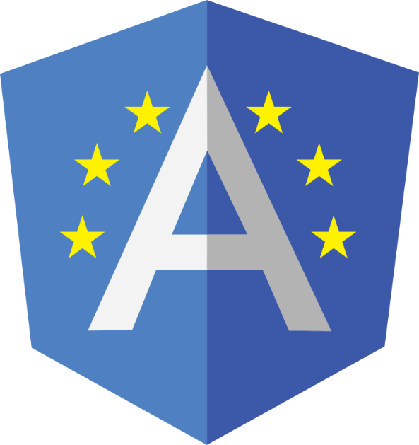

<!DOCTYPE html>
<html lang="en">
<head>
  <meta charset="UTF-8">
  <meta http-equiv="X-UA-Compatible" content="IE=edge">
  <meta name="viewport" content="width=device-width, initial-scale=1.0">
  <meta charset="UTF-8"/>
  <meta content="width=device-width, initial-scale=1" name="viewport" />
  <meta name="DC.Language" scheme="RFC1766" content="Spanish">
  <meta name="autor" content="Andres Antonio Cardoso">
  <meta name="reply-to" content="datagroupssl@gmail.com">
  <link rev="made" href="mailto:datagroupssl@gmail.com">
  <meta name="description" content="Andres Antonio Cardoso, Developer Full Stack y Diseñador Grafico.">
  <meta name="copyright" content="Propietario del copyright" />
  <meta name="keywords" contennt="desarrollo web, website, front end developer">
  <meta name="Resource-type" content="Index">
  <meta name="Revisit-after" content="1 days">
  <meta name="robots" content="all">
 <title>⠀</title>
</head>
<body>

<!-- INICIO BANNER -->

  

<!-- INICIO TYPING  -->

  

---

<!-- INICIO BANDERAS  -->

  
  &#8287;&#8287;&#8287;&#8287;&#8287;
  
  &#8287;&#8287;&#8287;&#8287;&#8287;
  

<!-- INICIO MENSAJE -->

## 📌- Formamos mundos e identidades visuales, construidos sobre la base del pensamiento y el diseño interdisciplinarios, siempre desafiando el status quo. Fusionamos el arte del Codigo con el Diseño Grafico.

<!-- INICIO BADGES -->

  ⠀⠀⠀⠀⠀⠀⠀⠀⠀<a href="https://github.com/datagroupssl/standard-readme">⠀</a>⠀⠀⠀⠀⠀ 
  

  

<!-- INICIO NOVEDADES  -->

## NOVEDADES 

    <i>PROXIMAMENTE, la traduccion en:</i>⠀
      
    <a href="https://github.com/zerhocool">⠀</a>
    <a href="https://github.com/zerhocool">⠀</a>
    <a href="https://github.com/zerhocool">⠀</a>
    <a href="https://github.com/zerhocool">⠀</a>
    <a href="https://github.com/zerhocool">⠀</a> 
    <a href="https://github.com/zerhocool">⠀</a>

- [Best Template PRO](https://github.com/datagroupssl) Lanzamiento

- Migrando nuestro sistema a Web3

  
  
  
  
  

<!-- INICIO QUIEN SOY -->

    

      <h2>⠀</h2>
    

## QUIEN SOY !!!.

 

 

### 👱 Hola, soy ZERHO COOL un Developer Full Stack y Diseñador Grafico, desde España al mundo.

<h3 align="left">📌- Mis inicios fueron en 1996 trabajar como Programador Freelancer, emigre a España y funde mi propia empresa DATA GROUP en el año 2014, me especializo en Python, Javascript, Vue, Kali, etc. con + 10 años de experiencia. Actualmente con repositorios privados en otras plataformas, los cuales estoy migrando a GitLab.</h3>

 

 

### EXTRAS: 

#### 🖥️ Sistema Operativo:

- Arch Linux, teminal Xterm o eDEX-UI
- Windows 10 Pro, terminal Bash perzonalizada

#### 🍸 Intereses:

- DevOps - Protocolos de Comunicación
- Seguridad informática - Criptografía
- Documentacion de Software - Prompt Engineering - AI

#### 🕐 Idiomas:

- Aprendiendo Catalan y Estonio
- Mejorando mi Ingles

#### 📗 Ultimo libro:

- El libro negro del programador - El arte de la invisibilidad - Blue Team Handbook - Hacking Etico 101 - Biohacker - 
El libro blanco del hacker - Big Data, Machine Learning y Data Science en Python 

### INSIGNIAS: 

  
  &#8287;&#8287;&#8287;&#8287;&#8287;
  
  &#8287;&#8287;&#8287;&#8287;&#8287;
  
  &#8287;&#8287;&#8287;&#8287;&#8287;
  
  &#8287;&#8287;&#8287;&#8287;&#8287;

### 📌- Lenguajes, Frameworks, Bases de Datos y Cloud Hosting, etc que utilizo en mi dia a dia.

  

<!-- INICIO CARPETAS  -->

    

      <h2>⠀</h2>
    

### ULTIMOS REPOSITORIOS 

 

  &nbsp;&nbsp;&nbsp;&nbsp;
  &nbsp;&nbsp;

### MUSICA QUE ME INSPIRA 

 

### “La música es una herramienta de gestión increíblemente poderosa para aumentar la eficiencia de una fuerza laboral. Puede ejercer una influencia muy beneficiosa sobre la moral y la motivación de los empleados, ayudando a mejorar el rendimiento e incluso los resultados de la empresa”, declaró el neoropsicólogo David Lewis, director de Mindlab International, cuando se publicó el estudio.

 

  &nbsp;&nbsp;&nbsp;&nbsp;
  &nbsp;&nbsp;
  &nbsp;&nbsp;
  &nbsp;&nbsp;
  &nbsp;&nbsp;

<!-- INICIO ANALITICA -->

  

      <h2>⠀</h2>
  

## ¡OBTEN TUS ESTADISTICAS DE GITHUB GENERADAS DIARIAMENTE EN TU README!.

 

<h3>⚡ Metricas GitLab - GitKraken</h3>

  &#8287;&#8287;&#8287;&#8287;&#8287;
  
  &#8287;&#8287;&#8287;&#8287;&#8287;
  
  &#8287;&#8287;&#8287;&#8287;&#8287;
  

---

<h3>⚡ Metricas WakaTime</h3>

  &#8287;&#8287;&#8287;&#8287;&#8287;
  
  &#8287;&#8287;&#8287;&#8287;&#8287;
  
  &#8287;&#8287;&#8287;&#8287;&#8287;

<!-- INICIO CONTACTO -->

  

    <h2>⠀</h2>
  

  

   

  

## Póngase en contacto:

### Resuelva sus inquietudes sobre los productos, las ventas, el soporte, la capacitación, los servicios y otros temas.

 Casi todos mis proyectos son código abierto e intento responder a todos los usuarios que necesiten ayuda con alguno de estos proyectos, obviamente, esto toma tiempo.

 No obstante, si estás utilizando este proyecto y estás feliz con él o simplemente quieres animarme a que siga creando cosas, aquí tienes algunas maneras de hacerlo:

- ✔ Darme créditos cuando estés utilizando este README, añadiendo un link a este repositorio ⭐

- ✔ Dándole una estrella (starring) y compartiendo el proyecto 🚀

  

### Ubicacion:

### Contacto:

  &#8287;&#8287;&#8287;&#8287;&#8287;
  

---

## FORMAS DE PAGO⠀

Medios de pagos que aceptamos Euros y Tarjetas de credito en el mundo:

  
  &#8287;&#8287;&#8287;&#8287;&#8287;
  
  &#8287;&#8287;&#8287;&#8287;&#8287;
  
  &#8287;&#8287;&#8287;&#8287;&#8287;
  
  &#8287;&#8287;&#8287;&#8287;&#8287;
  
  &#8287;&#8287;&#8287;&#8287;&#8287;

---

⠀TRANSFERENCIAS Y BITCOIN

- ✔ CVU: `0000177500000006134907`

- ✔ BTC: `1LiJgSrQc4tTyBcsVK6DMxMC3J8DJ5FzMD`

- ✔ USDT Red TRC20: `TRbepPuT16zyViiyr4vBrG614XhFcjL9WV`

- ✔ Toncoin TON: `UQAukJzjgRpPJ6aMSWqsttfiBycB7ekDcNvDE9TSQcJyRyzD`

- ✔ Usuario Telegram: @zerhocool

  

---

> [!TIP]
> Leer👷 En Argentina Solo Dolares a la cotizacion `BLUE` del dia, en efectivo. `SIN EXEPCIONES` debido a la situacion que atravieza el pais, SOLO CLIENTES.

## Puedes ayudarme invitandome un cafe.

<footer>

<!-- INICIO SPONSOR -->

- Ser Sponsor, mas informacion en [`CONTRIBUTORS.md`](https://#)

  
  &#8287;&#8287;&#8287;&#8287;&#8287;
  
  &#8287;&#8287;&#8287;&#8287;&#8287;

- Gracias a estas empresas por su apoyo y confianza en este equipo.

## Apoyamos esta causa⠀

---

<!-- INICIO ANALITYCS  -->

  <i>GA4 G-7X*08T**** - Visitas de perfil:</i>⠀

  ⠀⠀⠀⠀⠀⠀⠀
  

🕐 Actualización cada 24 hs a las 00:00:08 Estonia hora local.

 

  
  &#8287;&#8287;&#8287;&#8287;&#8287;
  

---

<!-- INICIO COPY  -->

Diseño y Desarrollo por DATA GROUP - Copyrigh © 2014-present DATA GROUP - Todos los derechos reservados.

⠀⠀⠀⠀⠀⠀⠀⠀⠀ Esta obra está bajo <a rel="licencia" href="https://www.gnu.org/licenses/gpl-3.0.html">Licencia GNU General Publica (GNU GPL v3.0) -</a>
<a rel="licencia" href="https://sfconservancy.org/">Software Freedom Conservancy.</a>

 

  

🔹 Si tu gustó este README scanea el codigo QR, deja tu Like 👍, haz algún comentario y no olvides Suscribirte a este CANAL.

  

---

</footer>

</body>

</html>
